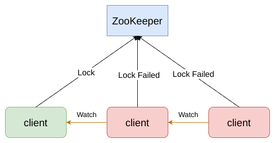
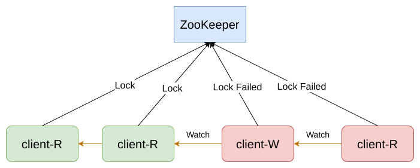
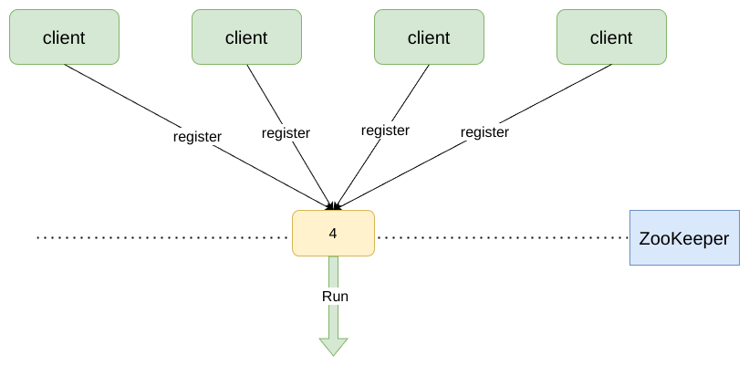
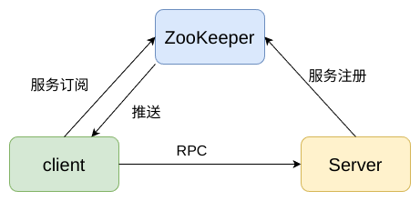
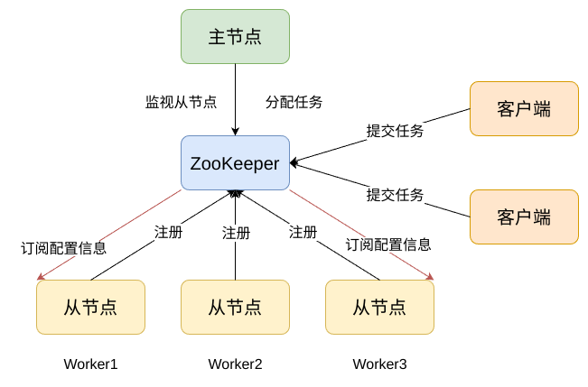

## 基础模块

### 分布式排他锁

排他锁（Exclusive Locks，简称 X 锁），又称为写锁或独占锁。如果事务 T1 对数据对象 A 加上了排他锁，那么在整个加锁期间，只允许事务 T1 对 A 进行读取和更新操作，其他任何事务都不能再对这个数据对象进行任何类型的操作——直到T1释放了排他锁。

结合分布式 FIFO 队列，避免在大规模场景下因释放锁导致的短时间内大量事件通知(羊群效应)

### 分布式共享锁

共享锁（Shared Locks，简称S锁），又称为读锁。如果事务 T1 对数据对象 A 加上了共享锁，那么当前事务只能对 A 进行读取操作，其他事务也只能对这个数据对象加共享锁——直到该数据对象上的所有共享锁都被释放。

### 分布式 Barrier

Barrier原意是屏障，在分布式系统中，特指系统之间的一个协调条件，规定了一个队列的元素必须都集聚后才能统一进行安排，否则一直等待。这往往出现在那些大规模分布式并行计算的应用场景上：最终的合并计算需要基于很多并行计算的子结果来进行。

## RPC 模块

在 RPC 调用过程中，ZooKeeper 为 Client 提供服务发现功能，Server
向 ZooKeeper 注册服务，ZooKeeper 记录服务与 Server IP 的映射关系，Client 通过服务名通过 ZooKeeper 获取到 Server IP,连接 Server 进行 RPC 调用。Client 订阅 ZooKeeper 上的服务映射关系，当该服务映射发生变化时，ZooKeeper 及时推送新的数据给 Client。

## Master-Slave

主-从模式的模型中包括三个角色：

主节点\
主节点负责监视新的从节点和任务，分配任务给可用的从节点。

从节点\
从节点会通过系统注册自己，以确保主节点看到它们可以执行任
务，然后开始监视新任务。

客户端\
客户端创建新任务并等待系统的响应。

从节点向 ZooKeeper 注册自己，并订阅相关的配置文件(如本地数据库信息，本地 host 绑定)，之后等待主节点的任务分配。客户端向 ZooKeeper 提交任务请求，之后等待任务结果。主节点通过负载均衡策略分配任务到从节点中，从节点执行任务并提交任务执行状态。客户端检测任务执行状态，若成功则主节点删除此次任务。
